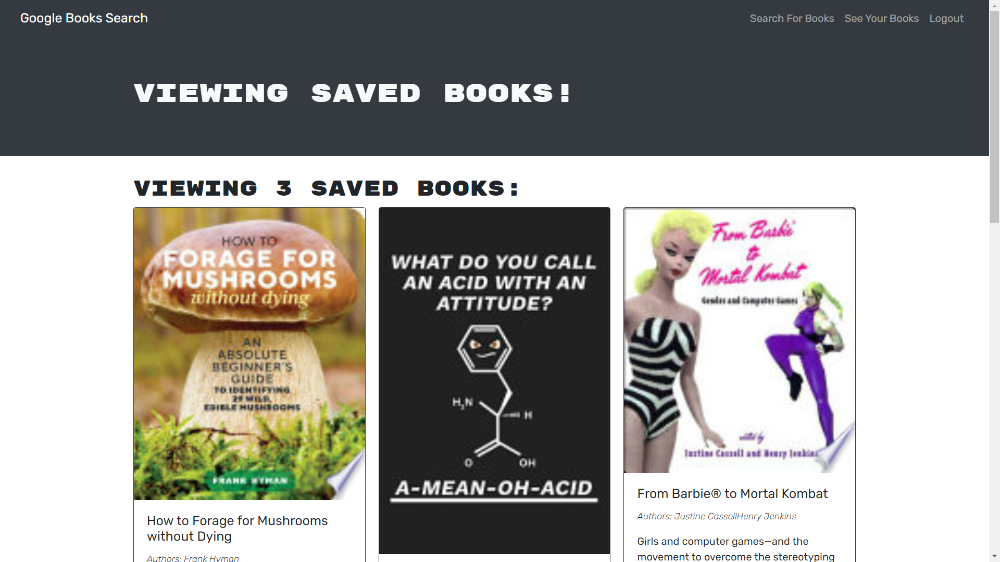

# Google Books Search

## Link to website

https://googlebookssearch-89b1230c1db2.herokuapp.com/

## Description
I wanted to create a website for avid reads to search for new books to read so that they can keep a list of books to purchase

## Table of contents
- [Installation](#installation)
- [Usage](#usage)
- [License](#license)
- [Contribution](#contribution)
- [Tests](#tests)
- [Questions](#questions)
 

## Installation
N/A - you can use the live website. if You want, you can clone the repo, then in the file do npm i then npm run develop, and you can use the website locally. Otherwise, go to the live link: https://googlebookssearch-89b1230c1db2.herokuapp.com/

## Usage
You can search the name of different books. To be able to save a list of books, you need to log in or sign up. Once you sign up,nyou are logged in and can start saving. Search the name of a book, and at the bottom you will find a button to save the book, as well as a link to the book to purchase on google. Click to save the book. Now in the nav bar, head to the See your books page to see  your saved list. If you purchased hat book and no longer want to have it saved, you can press the remove book button in your books page. 

 

## License
MIT License https://opensource.org/licenses/MIT

    Copyright (c) 2023 zeinahares
    
    Permission is hereby granted, free of charge, to any person obtaining a copy of this software and associated documentation files (the "Software"), to deal in the Software without restriction, including without limitation the rights to use, copy, modify, merge, publish, distribute, sublicense, and/or sell copies of the Software, and to permit persons to whom the Software is furnished to do so, subject to the following conditions:
    
    The above copyright notice and this permission notice shall be included in all copies or substantial portions of the Software.
    
    THE SOFTWARE IS PROVIDED "AS IS", WITHOUT WARRANTY OF ANY KIND, EXPRESS OR IMPLIED, INCLUDING BUT NOT LIMITED TO THE WARRANTIES OF MERCHANTABILITY, FITNESS FOR A PARTICULAR PURPOSE AND NONINFRINGEMENT. IN NO EVENT SHALL THE AUTHORS OR COPYRIGHT HOLDERS BE LIABLE FOR ANY CLAIM, DAMAGES OR OTHER LIABILITY, WHETHER IN AN ACTION OF CONTRACT, TORT OR OTHERWISE, ARISING FROM, OUT OF OR IN CONNECTION WITH THE SOFTWARE OR THE USE OR OTHER DEALINGS IN THE SOFTWARE.

## Contribution
N/A 

## Tests
N/A 
## Questions - 
  
Feel free to reach me for questions at anytime!

  GitHub URL: https://github.com/zeinahares 

  Email Address: zeinahares@gmail.com 
